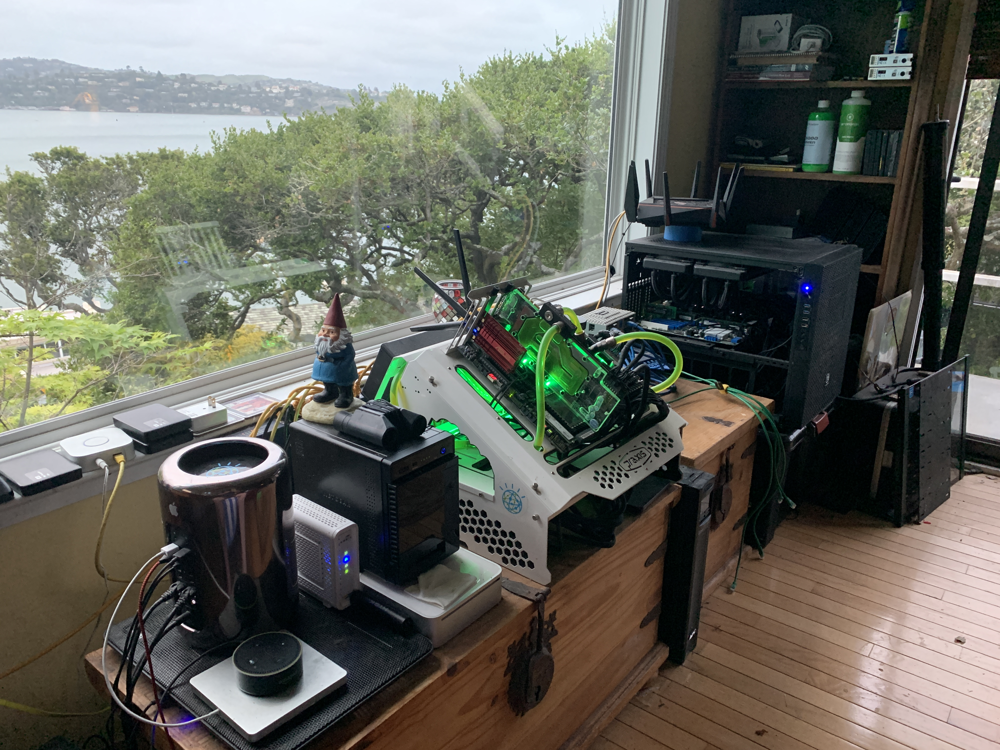

## Terraform HA Kubernetes

This project shows how I deploy HA Kubernetes onto my home-built VMWare ESXi lab, using a combination of Terraform and Ansible:

My home lab consists of three servers:

- System hardware & build info:
		
	Custom: ['The GPU Rig'](https://pcpartpicker.com/user/aaroncody/builds/#view=YbNNnQ)
	
	Custom: ['The Cheap ESXi Server'](https://pcpartpicker.com/user/aaroncody/builds/#view=V7dXsY)
	
	Apple Mac Pro: 'The not so Cheap ESXi Server'
	
- Water-Cooling 

	For extra nerd points I decided to water-cool the GPUs - why not! In practice though, you can see major performance 
	improvements during lengthy training cycles..
	After that I decided water cooling was the way to go and even water-cooled the CPU's in my cheap ESXi server.
	With all this hardware in my little office, consuming as much electricity as my hot tub, temps get high, especially 
	during the summer, so I think this was a wise decision.
	
- Running VMWare ESXi

	I use the 'Essentials' pack which allows vCenter to work with up to 3 hypervisors for only $500 ! I don't have any more room
	for servers in here so that worked out to be perfect.
	
- Using GPUs from Virtual Machines

	Here I plan to talk about the joys of PCI pass-through :)
	
- Kubernetes

	On top of ESXi I'm running high availability Kubernetes (a master node on each hypervisor)
	I use Ansible to roll out the entire cluster from scratch, provisioning the VMs, installing the software 
	and configuring it - so I can tear *everything* down and bring it all back up in a completely automated fashion. This is
	especially great when rogue experiments put the system into a weird state - I can just reset the whole system, come back 
	in a few hours and it's all brand new again. Also this makes trying out new versions of Kubernetes much easier.

- Storage

	I use a 12TB NAS server	as well as various SSD cards on the hypervisors for faster local storage. In K8s I implement a 
	high-availability NFS server (Pacemaker/Corosync) using two VM's (master/slave) to expose various NFS mount points and 
	kubernetes PV's. 
	Also Heketi/Gluster DFS.
	
- Networking

	Everything hangs off a Netgear ProSafe smart switch (which supports VLANs).
	For wifi I use an ASUS ROG wifi router, which I'm pretty sure is frying my brain it's so powerful
	Gigabit Ethernet coming in thanks to ATT Fiber (plus a tricky setup to make that work with my ASUS router)
	
- APC 

	Two APC units (we get frequent power outages here) which are tied into vCenter to gracefully shut down my VMs before
	lights out.

## Deploy Kubernetes !

- Assumption: you have a Bind9 DNS server running somewhere - configured so that Terraform can update it - see [README](cluster/local.esxi/terraform-k8s/modules/dns/README.md)

- Step 1: follow instructions in [README](artifacts/README.md)

- Step 2: edit the [Ansible hosts file](cluster/local.esxi/hosts) to suit your particular cluster needs

- Step 3: edit the [Terraform variables file](cluster/local.esxi/terraform-k8s/variables.tf) to suit your particular cluster needs

- Step 4: install ansible (2.9.0) and terraform CLI tools on your machine

- Step 5: open a terminal window in [k8s/sh](k8s/sh) and run:

		bash create-cluster.sh {your local password here}
		
- Step 6: Once complete, in another terminal window type:

		kubectl -n kubernetes-dashboard describe secret "$(kubectl -n kubernetes-dashboard get secret | grep admin-user | awk '\''{print $1}'\'')"
		
	then browse to:
		
		localhost:8001/api/v1/namespaces/kubernetes-dashboard/services/https:kubernetes-dashboard:/proxy/
		
	to bring up the kubernetes dashboard, pasting in the token generated above